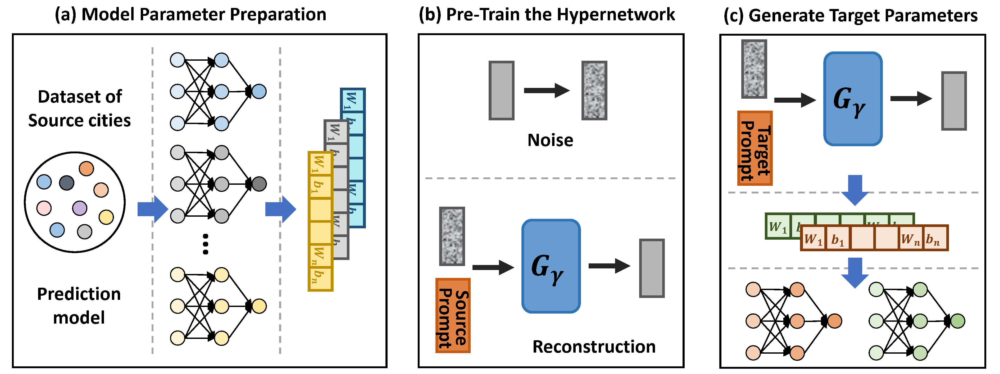
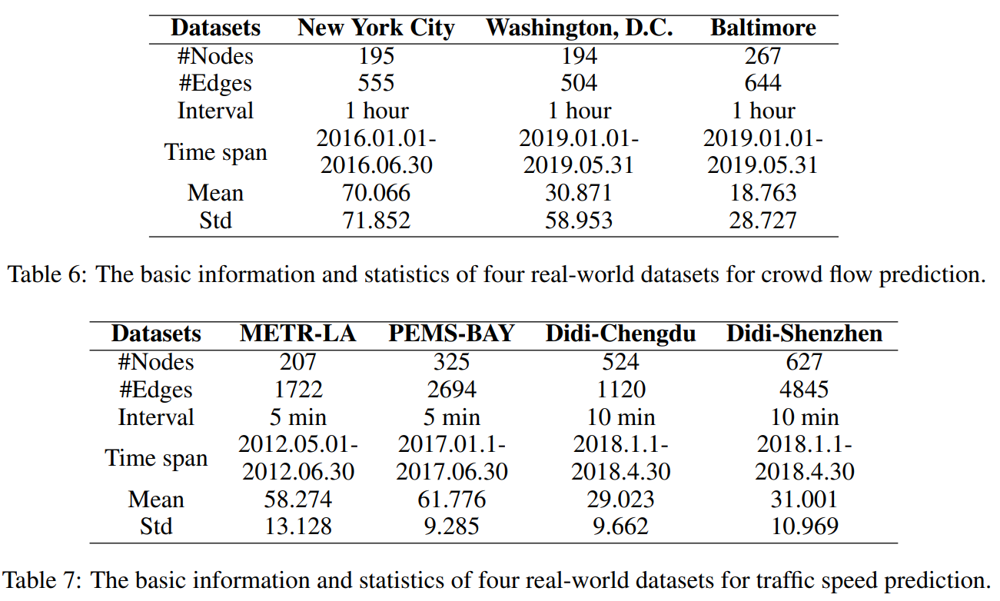
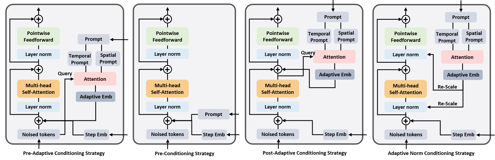

## Spatio-Temporal Few-Shot Learning via Diffusive Neural Network Generation



The official implementation of the ICLR 2024 paper entitled "Spatio-Temporal Few-Shot Learning via Diffusive Neural Network Generation". 

In this project, we propose a novel framework, GPD, which performs generative pre-training on a collection of model parameters optimized with data from source cities. Our proposed approach recasts spatio-temporal graph transfer learning as pre-training a generative hypernetwork, which generates tailored model parameters guided by prompts. 
Our framework has the potential to revolutionize smart city applications in data-scarce environments and contribute to more sustainable and efficient urban development.

## Installation
### Environment
- Tested OS: Linux
- Python >= 3.8
- torch == 1.12.0
- torch_geometric == 2.2.0
- Tensorboard

### Dependencies:
1. Install Pytorch with the correct CUDA version.
2. Use the ``pip install -r requirements.txt`` command to install all of the Python modules and packages used in this project.

<!--
## Requirements
- accelerate==0.23.0
- einops==0.7.0
- ema_pytorch==0.2.3
- matplotlib==3.5.3
- numpy==1.23.2
- PyYAML==6.0.1
- PyYAML==6.0.1
- scikit_learn==1.1.2
- scipy==1.9.1
- torch==1.12.0+cu113
- torch_geometric==2.2.0
- torchsummary==1.5.1
- tqdm==4.64.0
- xlrd==2.0.1
- xlwt==1.3.0
-->

## Data
The data used for training and evaluation can be found in [Time-Series data](https://drive.google.com/drive/folders/1dI6sV67LxBrksnBdYputnB3rrIeqYzRR?usp=sharing).
After downloading the data, move them to ./Data.

For each city, we provide the following data:
- ``Graph data``: It records the adjacency matrix of the spatiotemporal graph. 
- ``Time series data``: It records the temporal sequential data for each node.

We provide two time-series datasets: crowd flow (including DC, BM, man) and traffic speed (including metr-la, pems-bay, shenzhen, chengdu_m).

The details of these two data sets are as follows:




## Model Training

To train node-level models with the traffic dataset, run:

``cd Pretrain``

``CUDA_VISIBLE_DEVICES=0 python main.py --taskmode task4 --model v_GWN --test_data metr-la --ifnewname 1 --aftername TrafficData``

After full-trained, run Pretrain\PrepareParams\model2tensor.py to extract parameters from the trained model. And put the params-dataset in ./Data.

To train diffusion model and generate the parameters of the target city:

``cd GPD``

``CUDA_VISIBLE_DEVICES=0 python 1Dmain.py --expIndex 140 --targetDataset metr-la --modeldim 512 --epochs 80000 --diffusionstep 500 --basemodel v_GWN  --denoise Trans1``

- ``expIndex`` assigns a special number to the experiment.
- ``targetDataset`` specifies the target dataset, which can be selected from ['DC', 'BM', 'man', 'metr-la', 'pemes-bay', 'shenzhen', 'chengdu_m'].
- ``modeldim`` specifies the hidden dim of the Transformer.
- ``epochs`` specifies the number of iterations.
- ``diffusionstep`` specifies the total steps of the diffusion process.
- ``basemodel`` specifies the spatio-temporal graph model, which can be selected from ['v_STGCN5', 'v_GWN'].
- ``denoise model`` specifies the conditioning strategies, which can be selected from ['Trans1', 'Trans2', 'Trans3', 'Trans4', 'Trans5'].
  - Trans1: Pre-conditioning with inductive bias.
  - Trans2: Pre-conditioning.
  - Trans3: Pre-adaptive conditioning.
  - Trans4: Post-adaptive Conditioning.
  - Trans5: Adaptive norm conditioning.



The sample result is in GPD/Output/expXX/.

## Finetune and Evaluate
To finetune the generated parameters of the target city and evaluate, run:

``cd Pretrain``

``CUDA_VISIBLE_DEVICES=0 python main.py --taskmode task7 --model v_GWN --test_data metr-la --ifnewname 1 --aftername finetune_7days --epochs 600 --target_days 7``

  - ``taskmode`` 'task7' means finetune after diffusion sampling.
  - ``model`` specifies the spatio-temporal graph model, which can be selected from ['v_STGCN5', 'v_GWN'].
  - ``test_data`` specifies the dataset, which can be selected from ['DC', 'BM', 'man', 'metr-la', 'pemes-bay', 'shenzhen', 'chengdu_m'].
  - ``ifnewname`` assign 1 to better distinguish the results of the current experiment.
  - ``aftername`` Use with --ifnewname 1 to give an identification name to the log file and results folder of the current experiment.
  - ``epochs`` specifies the number of iterations.
  - ``target_days`` specifies the amount of data used in finetune stage.

<!--
## Model training & Evaluating
- We integrate the zeroshot evaluation module into the diffusion.
- Args Optional parameters：
  - expIndex：Assign a special number to the experiment.
  - targetDataset: The target dataset, can be selected from ['DC', 'BM', 'man', 'metr-la', 'pemes-bay', 'shenzhen', 'chengdu_m'].
  - modeldim: Transformer hidden dim.
  - epochs: Number of batches in diffusion learning.
  - diffusionstep: Steps of diffusion.
  - basemodel: can select from ['v_STGCN5', 'v_GWN'].
  - denoise model: Several implementations of transformer, the main difference between them is the use of conditions. Can be selected from ['Trans1', 'Trans2', 'Trans3', 'Trans4', 'Trans5'].
    - Trans1: Ordinary transformer, the kg embedding is added to the parameter section associated with the space.
    - Trans2: Conditions are added to each layer of transformer.
    - Trans3: After the conditions are aggregated, they are added to each layer of transformer.
    - Trans4: Cross attention.
    - Trans5: Adaptive LayerNorm.
```bash
cd GPD
CUDA_VISIBLE_DEVICES=3 python 1Dmain.py --expIndex 140 --targetDataset metr-la --modeldim 512 --epochs 80000 --diffusionstep 500 --basemodel v_GWN  --denoise Trans1
-->
